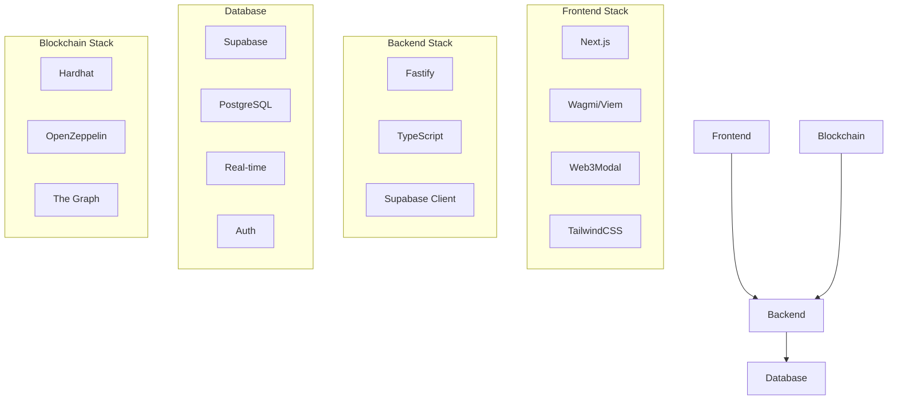
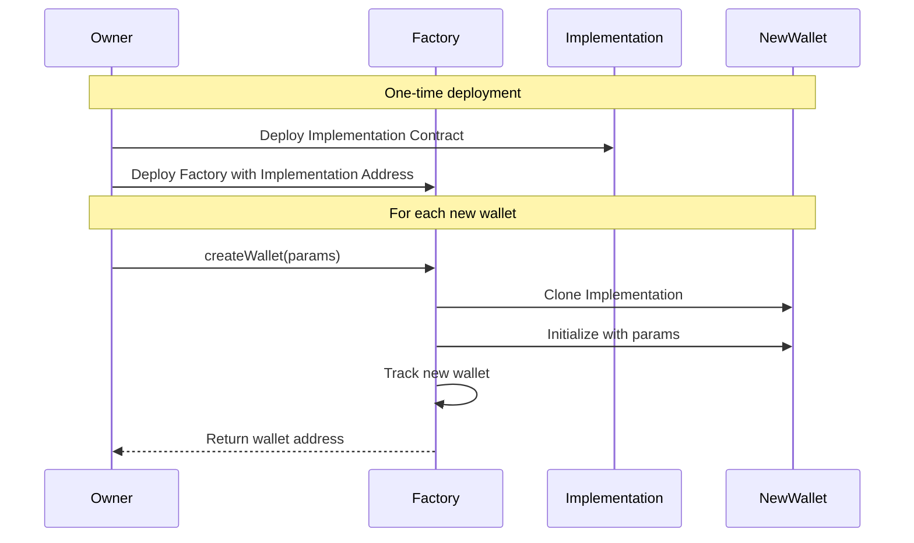
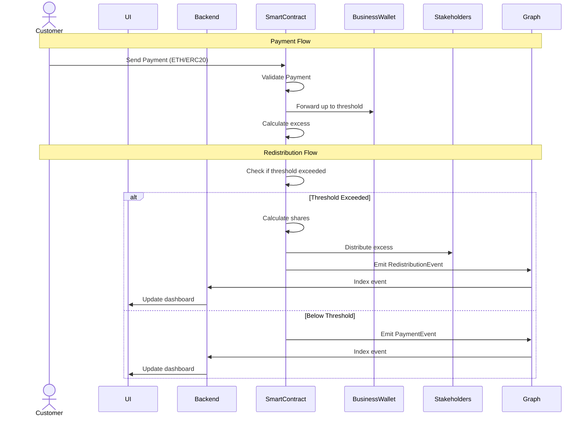

# System Architecture

## Overview

Capz enables businesses to automatically redistribute income to stakeholders (customers, employees, or open source projects) when receiving payments. The system creates smart contracts that handle the redistribution logic based on predefined thresholds and rules.

## User Types

1. **Business Owner**

   - Creates and manages smart accounts
   - Sets redistribution parameters
   - Receives funds up to threshold

2. **Customers**

   - Send payments to smart account addresses
   - Become stakeholders eligible for redistribution

3. **Stakeholders**
   - Customers who made purchases
   - Employees of the business
   - Open source projects
   - Receive redistributed funds automatically

## System Components



## Technology Stack

### Frontend Stack

- **Next.js**: Server-rendered React application
- **Wagmi/Viem**: Web3 interactions
- **Web3Modal**: Wallet connections with email login support
- **TailwindCSS**: Styling
- **The Graph**: Data indexing client

### Backend Stack

- **Fastify**: API server with TypeScript support
- **Supabase**: Database, auth, and real-time updates
- **TypeScript**: Type safety across the stack

### Smart Contract Stack

- **Hardhat**: Development & testing
- **OpenZeppelin**: Contract primitives
- **The Graph**: Indexing and events

## Smart Contract System

### Factory Pattern Implementation

```solidity
// SPDX-License-Identifier: MIT
contract CapzFactory {
    // Track all deployed wallets
    mapping(address owner => address[] wallets) public ownerWallets;

    // Implementation contract to clone
    address public immutable implementation;

    event WalletCreated(address indexed owner, address wallet);

    constructor(address _implementation) {
        implementation = _implementation;
    }

    function createWallet(
        uint256 threshold,
        uint256 periodDuration,
        uint256 startTime
    ) external returns (address wallet) {
        // Clone the implementation contract (minimal proxy pattern)
        wallet = Clones.clone(implementation);

        // Initialize the new wallet
        ICapzWallet(wallet).initialize(
            msg.sender,
            threshold,
            periodDuration,
            startTime
        );

        // Track the new wallet
        ownerWallets[msg.sender].push(wallet);

        emit WalletCreated(msg.sender, wallet);
    }
}

// The actual wallet implementation
contract CapzWallet is Initializable {
    address public owner;
    uint256 public threshold;
    uint256 public periodDuration;
    uint256 public startTime;

    function initialize(
        address _owner,
        uint256 _threshold,
        uint256 _periodDuration,
        uint256 _startTime
    ) external initializer {
        owner = _owner;
        threshold = _threshold;
        periodDuration = _periodDuration;
        startTime = _startTime;
    }

    // Rest of wallet logic...
}
```

### Deployment Flow



### Implementation Details

1. **Factory Contract**

   - Deployed once by Capz team
   - Uses minimal proxy pattern (EIP-1167) for gas-efficient cloning
   - Tracks all created wallets
   - Emits events for indexing

2. **Wallet Implementation**

   - Single implementation contract
   - Contains all wallet logic
   - Used as template for cloning
   - Upgradeable pattern for future updates

3. **Individual Wallets**
   - Cloned from implementation
   - Initialized with owner's parameters
   - Fully functional but minimal proxy
   - Lower deployment costs

### Deployment Process

1. **Initial Setup (Done once by Capz)**

```typescript
// scripts/deploy.ts
async function deploy() {
  // Deploy implementation
  const Implementation = await ethers.getContractFactory("CapzWallet");
  const implementation = await Implementation.deploy();
  await implementation.deployed();

  // Deploy factory
  const Factory = await ethers.getContractFactory("CapzFactory");
  const factory = await Factory.deploy(implementation.address);
  await factory.deployed();

  return { implementation, factory };
}
```

2. **Wallet Creation (For each user)**

```typescript
// frontend/src/hooks/useCreateWallet.ts
export function useCreateWallet() {
  const createWallet = async (params: WalletParams) => {
    const factory = new Contract(FACTORY_ADDRESS, FACTORY_ABI);
    const tx = await factory.createWallet(
      params.threshold,
      params.periodDuration,
      params.startTime
    );
    const receipt = await tx.wait();
    const event = receipt.events.find((e) => e.event === "WalletCreated");
    return event.args.wallet; // New wallet address
  };

  return { createWallet };
}
```

## Payment & Redistribution Flow



## Security Considerations

- Rate limiting for large transactions
- Threshold change timelock
- Stakeholder addition controls
- Regular security audits
