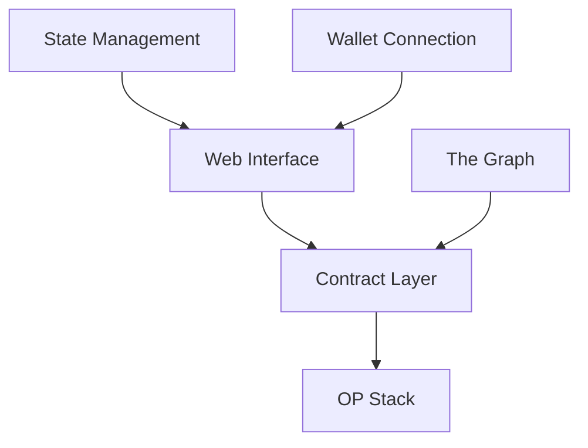
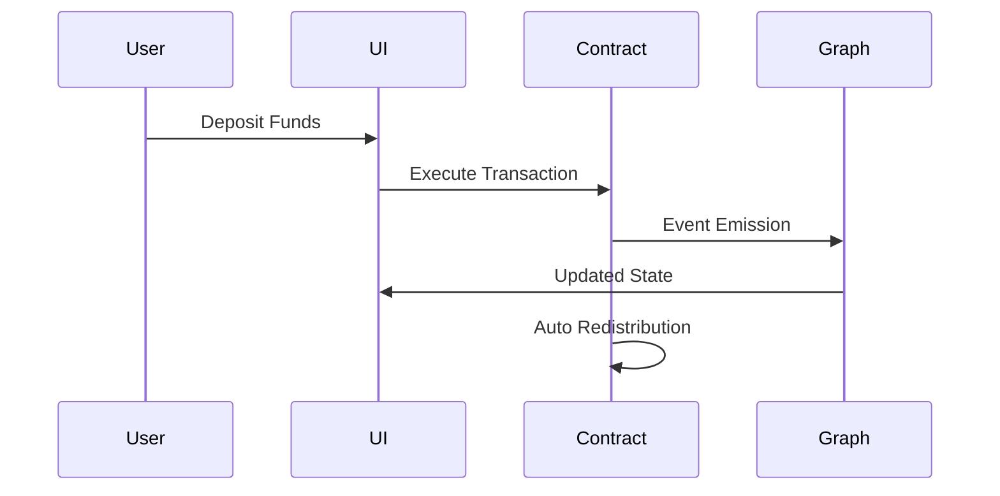

# System Architecture

## Overview
Capz is a fund redistribution platform built on OP Stack, enabling businesses to automatically share income with stakeholders based on predefined rules.

## System Components



## Core Components

### 1. Smart Contract Layer
Custom minimal contracts instead of smart wallets for:
- Lower gas costs
- Simplified logic
- Direct control over upgrades

```solidity
// Core functionality
contract CapzWallet {
    struct Config {
        uint256 threshold;
        address[] stakeholders;
        uint256[] shares;
    }
    
    function deposit() external payable;
    function redistribute() external;
}
```

### 2. Frontend Stack
- **Next.js**: Server-side rendering, optimal DX
- **Viem/Wagmi**: Type-safe contract interactions
- **TailwindCSS**: Rapid UI development
- **The Graph**: Efficient data indexing

### 3. Blockchain Layer
- **OP Stack**: Low fees, fast finality
- **UUPS Pattern**: Minimal upgrade capability
- **ERC20**: Token standard compatibility

## Data Flow



## Security Considerations
- Time-locked upgrades
- Circuit breakers
- Basic multi-sig for admin
- Regular security audits

## Scalability
- Event-driven indexing
- Batched redistributions
- Optimized storage patterns

## Development Phases
1. **Alpha**: Basic deposits & redistribution
2. **Beta**: Multiple stakeholder types
3. **Production**: Advanced features & optimizations

## Future Extensions
- Additional redistribution strategies
- Cross-chain compatibility
- Advanced governance
