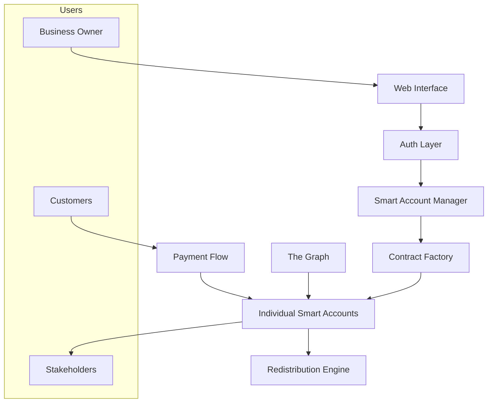
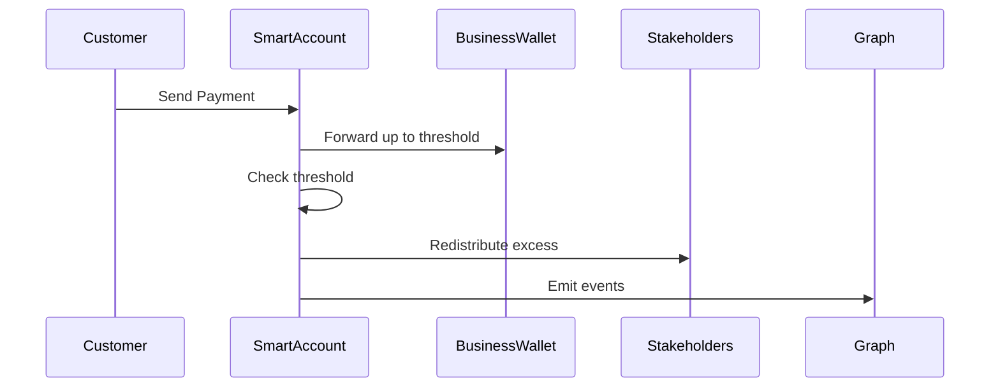

# System Architecture

## Overview
Capz enables businesses to automatically redistribute income to stakeholders (customers, employees, or open source projects) when receiving payments. The system creates smart contracts that handle the redistribution logic based on predefined thresholds and rules.

## User Types
1. **Business Owner**
   - Creates and manages smart accounts
   - Sets redistribution parameters
   - Receives funds up to threshold

2. **Customers**
   - Send payments to smart account addresses
   - Become stakeholders eligible for redistribution

3. **Stakeholders**
   - Customers who made purchases
   - Employees of the business
   - Open source projects
   - Receive redistributed funds automatically

## System Components



## Core Components

### 1. Smart Contract System

```solidity
// Factory creates individual smart accounts
contract CapzFactory {
    function createSmartAccount(
        address owner,
        uint256 threshold,
        uint256 periodDuration,
        uint256 startTime
    ) external returns (address);
}

// Individual smart account for each business
contract CapzAccount {
    struct Config {
        address owner;           // Business owner
        uint256 threshold;       // Amount before redistribution
        uint256 periodDuration; // Daily/Monthly/Quarterly/Yearly
        uint256 startTime;      // Period start
        address[] stakeholders; // Redistribution recipients
        uint256[] shares;       // Stakeholder shares
    }
    
    // Receive payments from customers
    receive() external payable;
    
    // Automatic redistribution when threshold is met
    function redistribute() internal;
    
    // Add stakeholders (e.g., after customer purchase)
    function addStakeholder(address stakeholder, uint256 share) external;
}
```

### 2. Frontend Stack
- **Next.js**: Server-rendered React for business dashboard
- **Wagmi/Viem**: Web3 interactions and wallet connections
- **The Graph**: Index smart account events and history

### 3. Payment Flow



## Key Technical Decisions

1. **Smart Account Implementation**
   - Custom contracts (not smart wallets) for gas optimization
   - Simple proxy pattern for potential upgrades
   - Event-driven for tracking payments and redistributions

2. **Stakeholder Management**
   - On-chain stakeholder registry
   - Efficient batch updates for multiple stakeholders
   - Share calculation based on contribution

3. **Payment Processing**
   - Support for ETH and common ERC20 tokens
   - Automatic threshold checking
   - Gas-optimized redistribution

## Development Phases

### Phase 1: Core Payment Flow
- Smart account creation
- Basic payment receiving
- Simple redistribution above threshold

### Phase 2: Stakeholder Management
- Stakeholder registration
- Share calculation
- Automated redistribution

### Phase 3: Enhanced Features
- Multiple token support
- Advanced redistribution strategies
- Historical data and analytics

## Security Considerations
- Rate limiting for large transactions
- Threshold change timelock
- Stakeholder addition controls
- Regular security audits

## Future Extensions
- Multiple redistribution strategies
- Cross-chain compatibility
- DAO governance options
